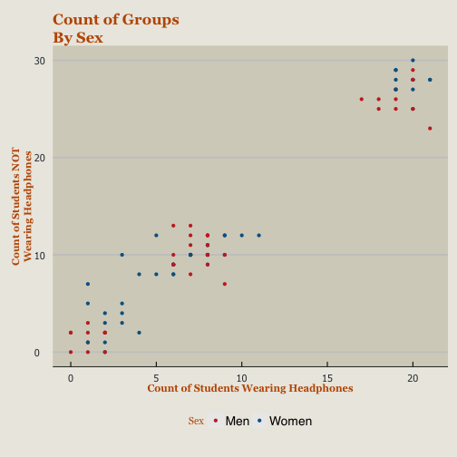

Who Listens To Music?
========================================================
author: Genevieve Korst 
date: December 5, 2015
font-family: 'Open Sans'


<div class="footer">http://rpubs.com/HunterRatliff1/133534</div>


Motivation: Topic
========================================================
**Why did you pick the topic you chose?**

- I enjoy observing people in social situations
- I always listen to music when I walk to class, 
- I’ve noticed that not everyone always does, 
- I want to see if there was a specific group or 
demographic that did that more than others.


Motivation: Topic
========================================================
**What were you interested in investigating?**

The differences in pre-class habits among different 
demographics.

**What relationships did you hypothesize would exist among your variables?**

I hypothesized that women would be more likely to listen 
to music while walking to class, but I didn’t think 
there would be a relationship between race/ethnicity 
and whether or not they listened to music.


Data Collection: Randomization
========================================================
**What did you do to get as “random” a sample as possible?**

I observed the students rather than surveyed them in order 
to prevent volunteer bias. I spread out my observations 
over multiple days and various locations in order to 
create a large enough and varied enough sample to 
control for selection bias.


Data Collection: Records
========================================================
**How many sample records did you end up with**


The total record count was 
<code> 1875</code>, 
with an overall breakdown of:

* <b>Yes:</b> <code> 782 </code>
* <b>No:</b> <code> 1093 </code>


Data Collection: Outliers
========================================================
**Did you remove any outliers?** No, I saw no need to remove any outliers




Results table
========================================================

**Report the results of your model in a table.**  
*The table will look different depending on whether 
you ran an ANOVA or a GLM, but be sure you include 
the appropriate estimates/sums of squares and test 
statistics for each explanatory variable and interaction 
term, along with an appropriate measure of how well the 
model fits the data.*


Results table: GLM
========================================================

<small>

```

Call:
glm(formula = Yes.percent ~ Race + Sex, data = Obs_df, weights = Total.Obser)

Deviance Residuals: 
     Min        1Q    Median        3Q       Max  
-0.81231  -0.09431   0.00205   0.12764   0.83128  

Coefficients:
              Estimate Std. Error t value Pr(>|t|)    
(Intercept)   0.411906   0.016359  25.180   <2e-16 ***
RaceBlack     0.005256   0.034266   0.153    0.878    
RaceHispanic  0.010577   0.020694   0.511    0.611    
RaceWhite     0.009433   0.017611   0.536    0.594    
SexWomen     -0.004969   0.013231  -0.376    0.708    
---
Signif. codes:  0 '***' 0.001 '**' 0.01 '*' 0.05 '.' 0.1 ' ' 1

(Dispersion parameter for gaussian family taken to be 0.08143281)

    Null deviance: 6.7160  on 86  degrees of freedom
Residual deviance: 6.6775  on 82  degrees of freedom
AIC: Inf

Number of Fisher Scoring iterations: 2
```
</small>


Results table: ANOVA
========================================================
<small>

```
            Df Sum Sq Mean Sq F value Pr(>F)
Race         3  0.027 0.00899   0.110  0.954
Sex          1  0.011 0.01148   0.141  0.708
Residuals   82  6.677 0.08143               
```
</small>


Method: GLM/ANOVA
========================================================
**What software did you use?  What function(s)?**

I used RStudio to in my analysis, utilizing the 
following packages

<code> magrittr, dplyr, reshape2, ggplot2, RCurl, ggthemes </code>

**Response variable:** The proportion of the population 
that listens to music on the way to class or not.

**Explanatory variables:** 

1. Race/ethnicity
2. Gender


Method: Response Variable
========================================================

**Description:** 
The response variable is the proportion of students 
listening to music on the way to class, as well as 
the proportion of students not listening to music. I 
made a table that had a column for each potential 
response of the ethnicities and genders and whether 
they listened to music. 

**Method of measurement:** It was measured by 
observing the students at each of the locations 
and marking down a tally in each of the specific
columns. 

**Units:**: Count of people

Method: Explanatory Variables
========================================================
*Briefly describe your explanatory variables, how 
they were measured, and their units (if applicable).*

**Race/Ethnicity:** The race and/or ethnicity of each 
student observed. For simplicity, I made the best 
approximation that I could of their combined race and 
ethnicity of the student. Students fell into four 
broad catagories:

1. Asian (hispanic and non-hispanic)
2. Black (hispanic and non-hispanic)
3. Hispanic (and white)
4. White (non-hispanic)


Method: Explanatory Variables
========================================================
*Briefly describe your explanatory variables, how 
they were measured, and their units (if applicable).*

**Sex:** The biological sex of student observed (male 
or female). 

**Units:** For each location that I observed, I 
recorded the count of people observed wearing 
headphones and not wearing headphones.


Descriptives: Response Variable
========================================================
*Report the appropriate descriptive statistics of your 
response variable.  You can display these in a table 
like this*

<center>**Percentage of Students Wearing Headphones**</center>


|Race     |Sex   |   avg| median|   min|   max| variance| range|    sd|
|:--------|:-----|-----:|------:|-----:|-----:|--------:|-----:|-----:|
|Asian    |Men   | 0.423|  0.412| 0.316| 0.562|    0.004| 0.246| 0.061|
|Asian    |Women | 0.392|  0.412| 0.231| 0.471|    0.004| 0.240| 0.063|
|Black    |Men   | 0.417|  0.500| 0.000| 1.000|    0.126| 1.000| 0.356|
|Black    |Women | 0.469|  0.429| 0.125| 1.000|    0.061| 0.875| 0.246|
|Hispanic |Men   | 0.410|  0.400| 0.350| 0.474|    0.002| 0.124| 0.039|
|Hispanic |Women | 0.427|  0.429| 0.294| 0.478|    0.002| 0.184| 0.049|
|White    |Men   | 0.423|  0.417| 0.395| 0.477|    0.000| 0.082| 0.022|
|White    |Women | 0.415|  0.417| 0.396| 0.444|    0.000| 0.048| 0.016|


Descriptives: Explanatory Variables
========================================================
*Report the appropriate descriptive statistics for two 
of your main explanatory variables.  You can report 
them in a table like the one above, or in a contingency 
table.*

<center>**Contingency Table Percentage of Students Wearing Headphones**</center>


|      | Asian| Black| Hispanic| White|
|:-----|-----:|-----:|--------:|-----:|
|Men   |    80|    12|       81|   210|
|Women |    65|    24|       92|   218|


Discussion: Interpretation
========================================================
Interpret the results of your model in context.  

**What does  this analysis suggest about your variables?**  
Relate it back to the original goal outlined in your introduction!


Discussion: Limitations
========================================================
Were there any limitations with your analysis?  
- Was there a known bias in your sample collection?  
- Did your data fail any assumptions?  
- Can you think of any confounding variables that you didn’t control for?


Assumptions
========================================================
Which assumptions did you confirm?  Include how you 
checked each assumption, and if space permits, include any graphs you 
created to check them.


Interaction of Explanatory Vars
========================================================
Plot the interaction of your two explanatory variables (even if it is not significant).
Briefly (1-2 sentences or bullet points) interpret the graph.


Implications
========================================================
List at least one specific thing you would change if you were
to replicate this research.  
- How would that change impact your data or results?  
- Did you find that the method you used was sufficient in answering your research question?


Citation
========================================================
<small>
Copyright (C) 2015 Hunter Ratliff

This program is free software: you can redistribute it and/or modify
it under the terms of the GNU General Public License as published by
the Free Software Foundation, either version 3 of the License, or
(at your option) any later version.

This program is distributed in the hope that it will be useful,
but WITHOUT ANY WARRANTY; without even the implied warranty of
MERCHANTABILITY or FITNESS FOR A PARTICULAR PURPOSE.  See the
GNU General Public License for more details.

You should have received a copy of the GNU General Public License
along with this program.  If not, see <http://www.gnu.org/licenses/>.
</small>


